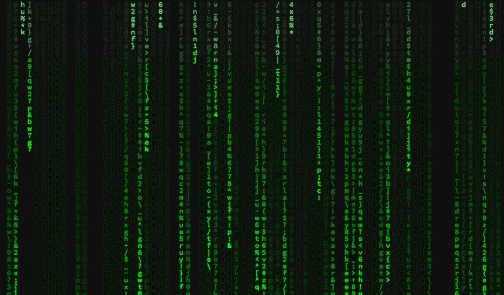

# screen-matrix
A lightweight raining code matrix that can be used as screensaver

## Credit
Original code from **Ebram Marzouk** [here](https://codepen.io/P3R0/pen/MwgoKv). Modified to be more "relaxing" to the eye i.e. optimized for screensaver.

## Installation
How to install screensaver as web view? First, you need to secure the url. You can fork and host this repository to your own web server OR copy gh-pages url:

https://lodev09.github.io/screen-matrix/

### macOS
Get/install **WebViewScreenSaver** [from here](https://github.com/liquidx/webviewscreensaver) and enter the url.

### Windows
Use the url and follow installation [from here](https://github.com/cwc/web-page-screensaver).
Note: Haven't tested this myself

## Enjoy!
Jovanni Lo [@lodev09](https://twitter.com/lodev09)
